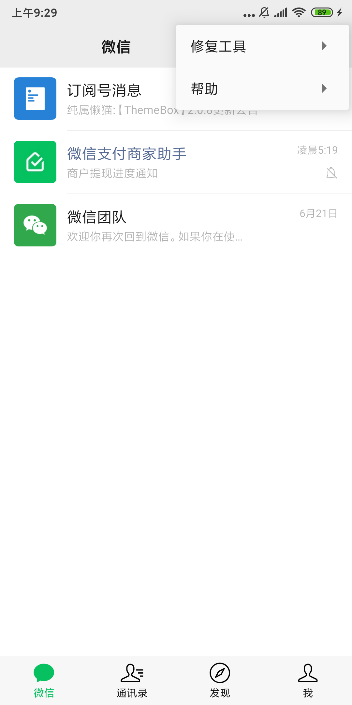
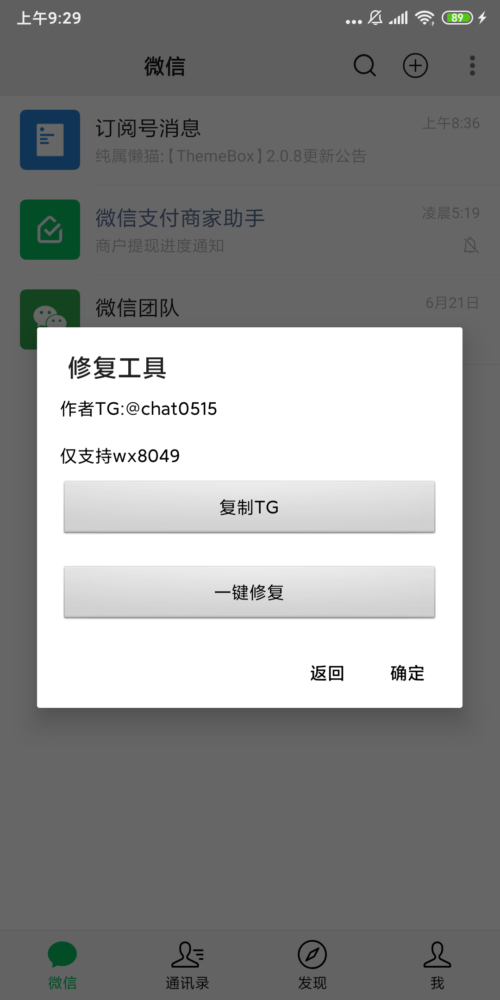
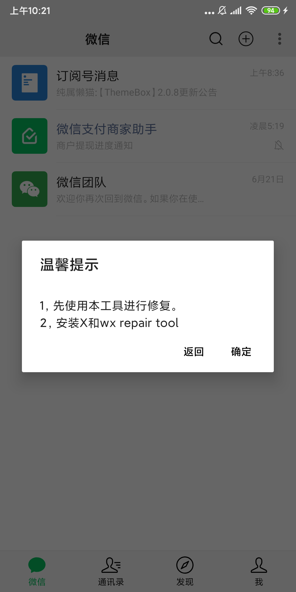
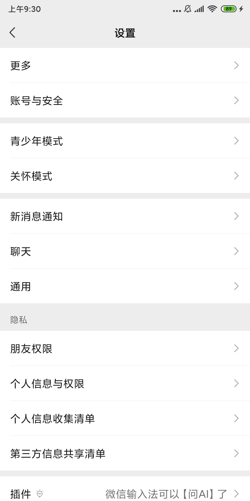
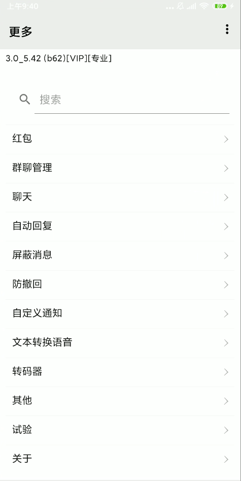

# FixWeXposed
一键修复微X模块，微X复活。
<b>
专治各种疑难杂症，无脑操作，一键操作，解放双手。

# 联系我
[Telegram](https://t.me/chat0515)

# 支持修复范围
 - LSPOSED
 - EDXPOSED
 - XPOSED
 - 免Root框架
 - 虚拟机
 - LSPatch
只要能正常加载微X的环境，基本都支持。

# 效果展示

